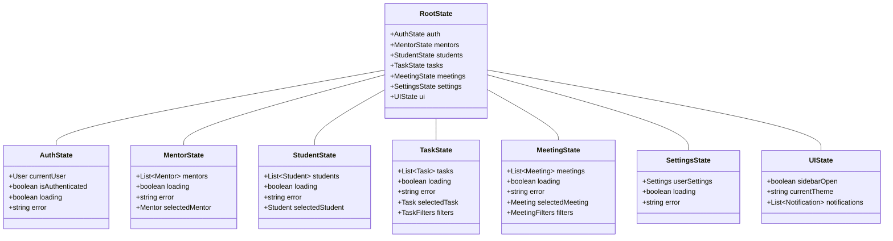

# 导师管理系统类图设计

## 核心实体类

## Redux Store 结构

## 组件结构

## 说明

1. **核心实体类**
   - 描述了系统中的主要数据模型
   - 包含实体间的关系
   - 定义了主要的业务方法

2. **Redux Store 结构**
   - 展示了状态管理的层次结构
   - 定义了各个模块的状态类型
   - 包含了状态间的关系

3. **组件结构**
   - 展示了 React 组件的层次结构
   - 定义了组件间的包含关系
   - 描述了主要的组件方法

## 设计原则

1. **单一职责原则**
   - 每个类都有明确的职责
   - 组件功能聚焦且独立

2. **开放封闭原则**
   - 实体类可以通过继承扩展
   - 组件通过属性配置实现扩展

3. **依赖倒置原则**
   - 使用接口而非具体实现
   - Redux 状态管理解耦了数据和视图

4. **接口隔离原则**
   - 组件间通过属性进行通信
   - 状态更新通过 action 触发

5. **组合复用原则**
   - 使用组件组合而非继承
   - 通过 HOC 和 Hooks 复用逻辑

## 注意事项

1. 类图使用 Mermaid 语法绘制，需要在支持 Mermaid 的 Markdown 查看器中查看
2. 实际实现时可能需要根据具体需求调整类的属性和方法
3. Redux Store 结构可能需要根据应用规模调整
4. 组件结构可能随着功能开发而扩展
